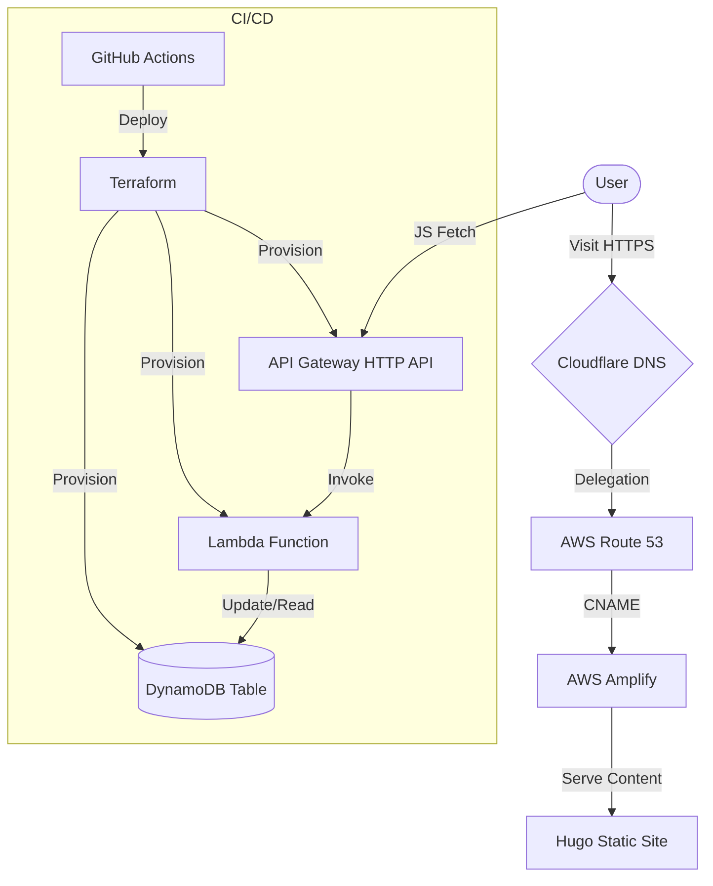

# Cloud Resume Challenge Architecture

## Data Flow
1. **Frontend**: The user visits `cv.aws10.dcoletasix2a.cat`.
2. **Counter**: JavaScript on the page calls API Gateway `GET /counter`.
3. **Backend**: Lambda receives the request, updates DynamoDB atomially, and returns the new count.
4. **Response**: Frontend displays the visitor count.
